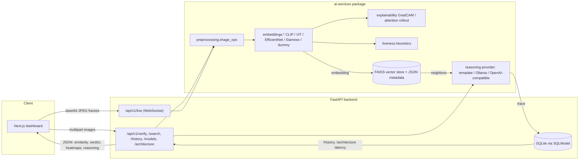

# Architecture

VisionIQ is a monorepo with three deployable pieces and one shared library:

```
frontend/      Next.js 14 (App Router) + TypeScript + Tailwind + shadcn/ui
backend/       FastAPI app (REST + WebSocket), SQLModel, services layer
ai-services/   installable Python package: embeddings, explainability,
                vector store, reasoning, liveness, preprocessing
legacy/        original Siamese-network research that informed
                ai_services.siamese
```

## Data flow



## Six-stage pipeline (mirrors the `/architecture` dashboard page)

| Stage | Module(s) | What happens |
| ----- | --------- | ------------- |
| 01 Capture | `backend/app/api/v1/verify.py`, `live.py`; `ai_services.preprocessing.image_ops` | Decode uploads/frames, strip EXIF, resize to a max dimension. |
| 02 Vision encoder | `ai_services.embeddings.*` | CLIP / ViT / EfficientNet / Siamese / dummy backbone produces a feature vector; liveness heuristics run on the same frame. |
| 03 Embedding head | `ai_services.embeddings.base.EmbeddingModel` | L2-normalized embedding (dimension depends on backend, 64-768d) used for cosine similarity. |
| 04 Vector memory | `ai_services.vector_store.faiss_store.FaissVectorStore` | Per-model `IndexFlatIP` (cosine via normalized vectors) + JSON metadata sidecar under `data/vector_store/<model>/`; `project_2d()` gives the 2D embedding map via SVD. |
| 05 Reasoning | `ai_services.reasoning.*`, `backend/app/services/reasoning_provider.py` | Template engine by default; optional Ollama or OpenAI-compatible adapters, both falling back to the template engine if the remote call fails. |
| 06 Serve + observe | `backend/app/main.py`, `db/models.py`, `services/architecture_service.py` | FastAPI REST/WS responses, `InferenceRecord` history in SQLite, and the `/architecture` endpoint that blends static pipeline metadata with measured latency from recent records. |

## Embedding registry

`ai_services.embeddings.registry` lazily imports backend modules so selecting `dummy`
never imports torch/transformers/torchvision. Each backend exposes static
`EmbeddingModelInfo` (name, display name, dimension, description, explainability kind)
consumed by `GET /api/v1/models`:

| Backend | Dimension | Explainability | Notes |
| ------- | --------- | --------------- | ----- |
| `dummy` | 64 | heuristic | Deterministic hashed projection; no downloads. Used by tests, CI, and local dev by default. |
| `clip` | 512 | attention rollout | `openai/clip-vit-base-patch32` via HuggingFace `transformers`. |
| `vit` | 768 | attention rollout | `google/vit-base-patch16-224-in21k`. |
| `efficientnet` | 1280 | Grad-CAM | torchvision EfficientNet-B0, classifier head removed. |
| `siamese` | 256 | Grad-CAM | `ai_services.siamese` ResNet18 trunk + projection head; loads `VISIONIQ_SIAMESE_CHECKPOINT` if set, otherwise ImageNet-pretrained weights with a fresh head. |

## Reasoning providers

`ai_services.reasoning.engine.build_reasoning_provider` selects between:

- **template** (default) - rule-based natural-language summary of similarity, distance,
  liveness, and vector neighbors. Always available, zero network calls.
- **ollama** - calls a local Ollama server (`VISIONIQ_OLLAMA_HOST`, `VISIONIQ_OLLAMA_MODEL`).
- **openai_compatible** - calls any OpenAI-compatible chat completions endpoint
  (`VISIONIQ_OPENAI_BASE_URL`, `VISIONIQ_OPENAI_MODEL`, `VISIONIQ_OPENAI_API_KEY`).

Both `ollama` and `openai_compatible` fall back to the template engine on any request
error, so the `/verify` endpoint never fails due to LLM infrastructure being down.

## Frontend

- `app/page.tsx` - dashboard: capture (upload/webcam tabs), score orb, telemetry
  sparklines (from `/history`), explainability heatmaps, embedding map + vector
  results (from `/search`), and the LLM reasoning trace + latency plot.
- `app/architecture/page.tsx` - six-node animated pipeline, runtime latency plot,
  API contract card, and deployment map, all driven by `GET /architecture`.
- `lib/api-client.ts` - typed fetchers for every REST endpoint plus a WebSocket URL
  helper; `lib/use-live-socket.ts` wraps `/api/v1/live` for the webcam panel.
- Design tokens (colors, radii, shadows) for the dark dashboard theme are defined in
  `tailwind.config.ts`.
