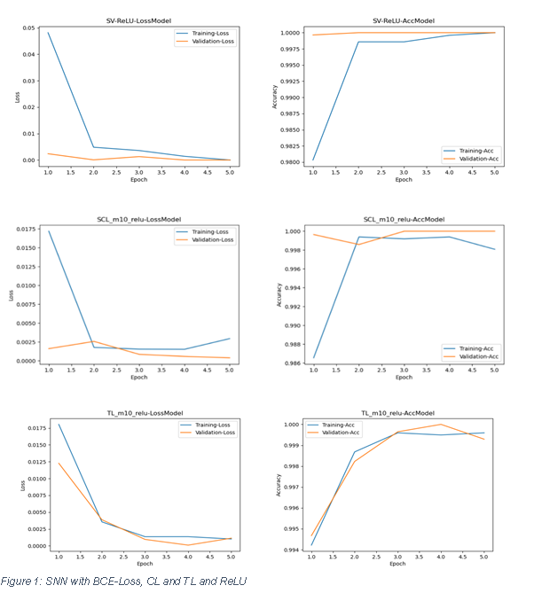

# Legacy Research: Siamese Networks for Face Recognition

This directory preserves the original research project this platform grew out of. The
modernized, production version of these ideas lives in
[`ai-services/ai_services/siamese`](../ai-services/ai_services/siamese) — a ResNet-based
Siamese embedding network that is selectable as the `siamese` backend in the VisionIQ
embedding registry, alongside CLIP, ViT, and EfficientNet.

## What's here

- `SN-Vanilla/` — baseline Siamese network trained with binary cross-entropy.
- `SN-ConstrativeLoss/` — Siamese network trained with contrastive loss.
- `SN-TripletLoss/` — Siamese network trained with triplet margin loss.
- `CreateImgDirectories.py`, `CreateAncPostPictures.py`, `DataAugmentation.py` — dataset
  preparation scripts for building anchor/positive/negative face crops.
- `Plotting.py` — training curve visualization helpers.
- `config.py` — original data-directory and device configuration.
- `Image/` — figures referenced by the original report.
- `requirements.txt` — original dependency list (torch, tensorflow, opencv, etc).

These scripts were originally run from the repository root (so `from config import
DEVICE` resolved against the top-level `config.py`). To run one of them today, either
copy `config.py` next to the script you want to run, or run it as a module from inside
`legacy/` with `legacy/` on `PYTHONPATH`, e.g.:

```bash
cd legacy
PYTHONPATH=. python SN-TripletLoss/trainModelTriplet.py
```

## Findings that informed the new platform

> Practical Work in AI: Optimizing SNN for Face Recognition — Boran Cihan Polat

The study compared Binary Cross-Entropy, Contrastive, and Triplet losses, and ReLU vs.
SeLU activations, for a custom CNN-based Siamese network on face-verification triplets.

- **Loss functions:** Triplet Loss gave the network the strongest ability to separate
  matching and non-matching faces.
- **Activation functions:** SeLU outperformed ReLU, likely due to its self-normalizing
  properties stabilizing training of the deep convolutional trunk.
- **Hyperparameters:** margin and learning-rate tuning materially affected convergence
  and accuracy — see `SN-TripletLoss/trainDiffHyper_Triplet.py` and
  `SN-ConstrativeLoss/trainDifferHyper_CL.py` for the sweep harnesses.

`ai_services/siamese` carries these conclusions forward: a triplet-margin loss is the
default training objective, contrastive loss remains available as an alternative, and
the backbone is upgraded from the original 4-layer custom CNN to a configurable
ResNet18 trunk with a projection head, fully integrated into the platform's embedding
registry, FAISS vector store, and GradCAM explainability pipeline.


